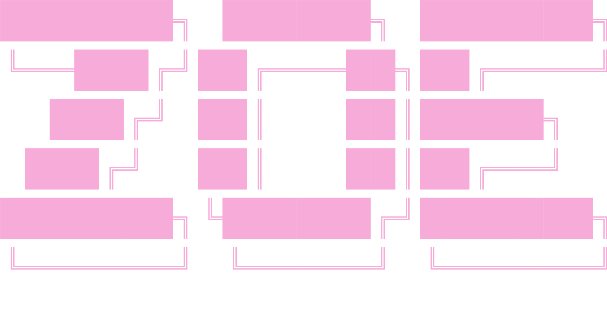

<h1 align="center">

</h1>

<h3 align="center">your local coffee addicted girl ♡</h3>

  

✨ I’m currently working on <a href="https://github.com/StarStruckEngine/StarStruck">StarStruck Engine</a>

🌱 I’m currently learning Graphics Programming in Vulkan

👨‍💻 Most of my projects are available Right here!

  

    <h3>♡ other things I can use ♡</h3>
  

  

