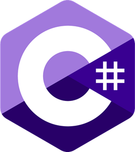
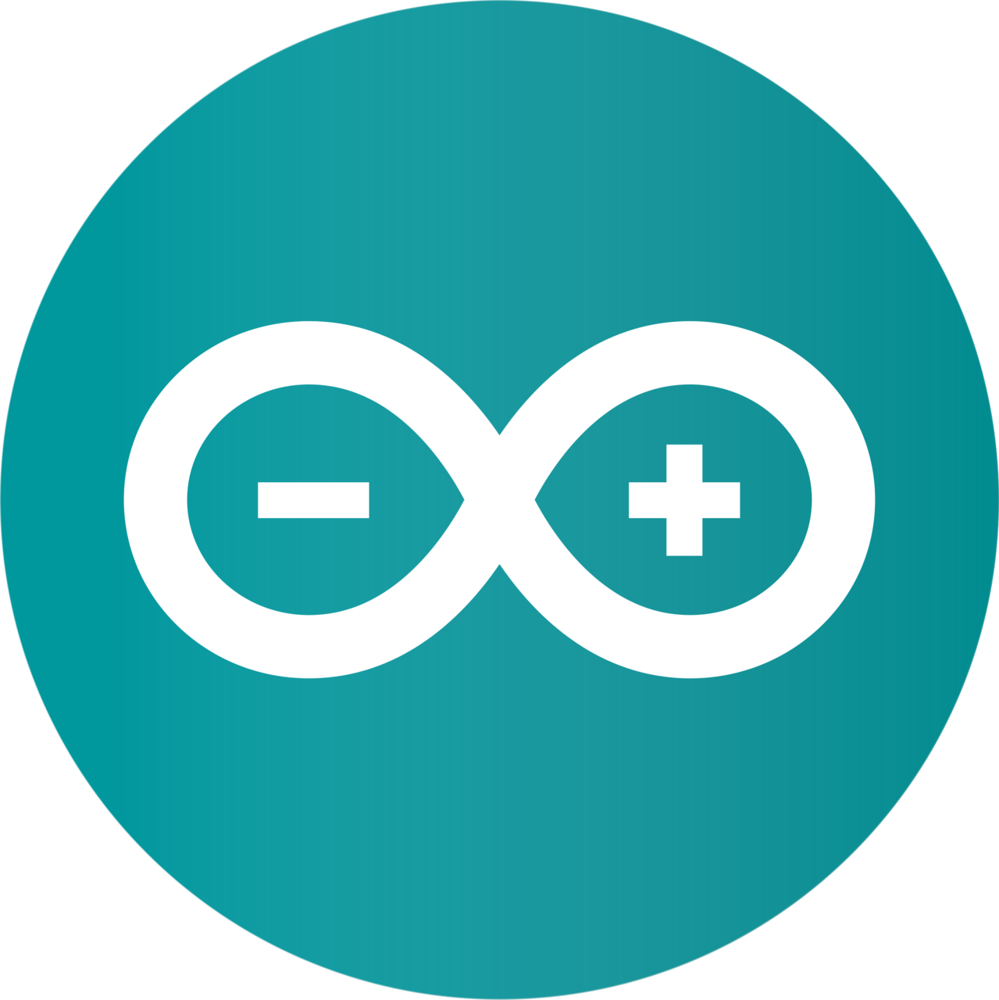
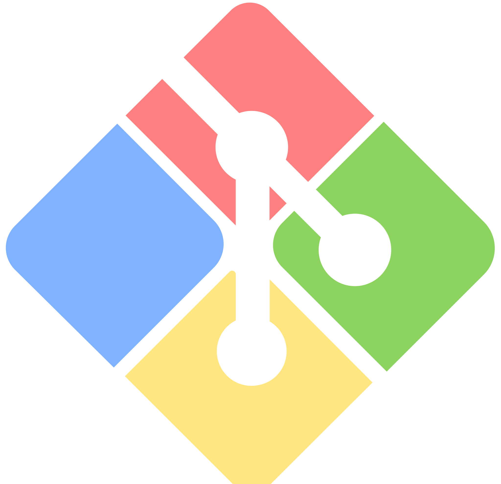

<h1 align="center">

</h1>

Haiii ~♡  I’m zoe! 

I am Hobbiest/Student 

that makes dumb Personal Projects  

⊹₊꒷︵︵︵୭﹒🍓🌸﹒୧︵︵︵₊˚⊹   

<h3 align="center">
Languages and Tools:
</h3>

&nbsp; 

  
&nbsp;&nbsp;   &nbsp;&nbsp;    &nbsp;&nbsp;   &nbsp;&nbsp;  &nbsp;&nbsp;    &nbsp;&nbsp;  &nbsp;&nbsp;    

<h3 align="center">
Software Knowlege:
</h3>

&nbsp; 

  
 &nbsp;&nbsp; &nbsp;&nbsp;   &nbsp;&nbsp;   &nbsp;&nbsp;  &nbsp;&nbsp;   &nbsp;&nbsp;   &nbsp;&nbsp;  &nbsp;&nbsp;  

<h3 align="center">
📫 How to reach me:
</h3>

&nbsp; 

  
  
  
 

&nbsp; 

